# AppGen Agent

从 App Store 需求挖掘到上架的**全链路多智能体系统**。

灵感来源于多 Agent 协作的产品自动化实践（类似 [BizRadar](https://github.com/LomaxWang/BizRadar) 的商机挖掘流水线、[OpenClaw 墨探+墨策](https://cloud.tencent.com/developer/article/2648521) 的 PRD 自动生成，以及 [Stora](https://stora.sh/products/agents) / [Antigravity](https://antigravitylab.net/en/articles/app-dev/antigravity-ios-appstore-release-pipeline-ai-automation-guide) 的上架自动化思路。

## 流水线架构

```mermaid
flowchart LR
    A[Scout<br/>App Store 挖掘] --> R1{Review}
    R1 --> B[Analyst<br/>需求拆解]
    B --> R2{Review}
    R2 --> C[PM<br/>PRD 撰写]
    C --> R3{Review}
    R3 --> D[Designer<br/>设计规格]
    D --> R4{Review}
    R4 --> E[DevInit<br/>开发计划]
    E --> R5{Review}
    R5 --> S[DevScaffold<br/>Xcode 脚手架]
    S --> R5b{Review}
    R5b --> C2[DevCode<br/>功能编码]
    C2 --> R5c{Review}
    R5c --> V[DevVerify<br/>编译验证]
    V --> R5d{Review}
    R5d --> F[QA<br/>测试计划]
    F --> R6{Review}
    R6 --> G[Store<br/>上架物料]
    G --> R7{Review}
    R7 --> H[完成]
```



每个节点产出结构化 JSON + Markdown/HTML 文档，并支持 **CLI / Web** 人工 Review 门禁。

**开发阶段（DevInit → DevVerify）** 按生产环境标准落地：XcodeGen 工程、MVVM SwiftUI 功能代码、`xcodebuild` 编译通过后才进入 QA。

## 十大 Agent

| Agent | 职责 | 主要输出 |
|-------|------|----------|
| **Scout** | App Store 榜单/搜索、竞品信号采集 | `01_opportunity.json` |
| **Analyst** | 需求拆解、MVP 边界、成功指标 | `02_requirements.json` |
| **PM** | 背景、用户、功能、付费、迭代 PRD | `03_prd.md` |
| **Designer** | UI 元素、交互、文案、色板 | `04_design.md` |
| **DevInit** | 技术栈、模块划分、Bundle ID、工期 | `05_dev_plan.json` |
| **DevScaffold** | XcodeGen 工程、Theme/Router、页面骨架 | `project/project.yml`, `project/` |
| **DevCode** | 按 PRD/设计稿分批生成功能 Swift 代码 | `05_dev_manifest.json` |
| **DevVerify** | `xcodebuild` 编译 + LLM 自动修复（最多 3 轮） | `05_build_report.json` |
| **QA** | 编译通过后的测试策略、冒烟清单 | `06_test_plan.md` |
| **Store** | 多语言 metadata、隐私协议、fastlane 目录 | `07_store_listing.md`, `fastlane/metadata/` |

## 覆盖区域

**仅美区与欧洲**，不含中国大陆/港澳台。默认扫描：

| 预设 | 包含 |
|------|------|
| `us` | 美国 |
| `eu` | 英国、德国、法国、西班牙、意大利、荷兰、瑞典、波兰、爱尔兰、葡萄牙 |
| `us-eu`（默认） | 美国 + 以上全部欧洲店面 |

可在 `.env` 中设置 `APPGEN_DEFAULT_REGIONS=us-eu`。

## 推荐使用流程

### 第一步：全分类扫描（先看大盘，再定方向）

```bash
# 默认：美区 + 欧洲 11 个店面 × 24 分类 × 免费榜
appgen scan run

# 仅美国
appgen scan run --regions us

# 仅欧洲
appgen scan run --regions eu

# 指定几个国家
appgen scan run --countries us,gb,de

# 同时看免费榜 + 付费榜 + 畅销榜
appgen scan run --charts top-free,top-paid,top-grossing

# 只扫描感兴趣的几个分类（更快）
appgen scan run --regions us --genres 6013,6007,6002

# 只采集原始数据，暂不调用 LLM 分析
appgen scan run --no-analyze
```

扫描产物在 `workspace/scans/<scan_id>/`：
- `categories/` — 每个分类的原始榜单 JSON
- `opportunities.json` — 结构化机会列表
- `scan_report.md` — 可读报告（背景、痛点、差异化、建议关键词）

榜单数据阶段使用**受控并发**拉取（默认 10 路，连接池复用），热门 7 类 + 美区通常 **数秒～十几秒** 完成；遇 HTTP 429 会自动退避重试，可在 `.env` 调整 `APPGEN_SCAN_CONCURRENCY`（建议 4–10）。

机会分析阶段将榜单**分批并发**调用 LLM（默认每批 6 个快照、3 路并发），分析过程中机会会**陆续写入**并在全部完成后按 `confidence_score` **重排**；Web 端轮询间隔 1.5s，并显示分析进度与 loading。

### 第二步：对比需求，选定方向

```bash
appgen scan list
appgen scan show <scan_id>        # 表格查看 Top 机会
# 或打开 workspace/scans/<scan_id>/scan_report.md 详细阅读
```

### 第三步：从选定方向启动完整流水线

```bash
# 从扫描报告里选第 3 条机会，进入 PRD → 设计 → 开发 → 上架 全流程
appgen scan pick <scan_id> 3

# 开发模式跳过各阶段人工 Review
appgen scan pick <scan_id> 3 --auto
```

### 已有明确关键词时（跳过扫描）

```bash
appgen run --keyword "pomodoro" --country us
```

## 快速开始

```bash
cd AppAgent
python3 -m venv .venv && source .venv/bin/activate
pip install -e ".[dev]"
cp .env.example .env
# 编辑 .env 填入 LLM_API_KEY

# iOS 编译验证（DevScaffold / DevVerify）需要 macOS + Xcode
brew install xcodegen
```

### CLI 运行

```bash
# 按关键词分析竞品并生成全链路产物
appgen run --keyword "番茄钟"

# 分析免费榜 Top 应用
appgen run --category top-free

# 开发模式：跳过人工 Review
appgen run --keyword "冥想" --auto

# 查看运行状态
appgen list
appgen status <run_id>

# 人工 Review 通过后恢复
appgen resume <run_id>
```

### Web Dashboard

```bash
# 首次或前端代码变更后构建
cd appgen/web/frontend && npm install && npm run build

# 启动服务（默认 http://127.0.0.1:8787）
appgen serve
```

前端为 Vue 3 + [Naive UI](https://github.com/tusen-ai/naive-ui)（参考 [Soybean Admin](https://github.com/soybeanjs/soybean-admin) 布局风格），源码在 `appgen/web/frontend/`。开发时可 `npm run dev`（端口 5173，API 代理到后端）。

Web 模式下每个阶段完成后会暂停，等待面板批准后继续。

## 产物目录

```
workspace/runs/<run_id>/
├── run.json                 # 全流程状态
├── 01_opportunity.json
├── 02_requirements.json
├── 03_prd.md
├── 04_design.md
├── 05_dev_plan.json
├── 05_dev_manifest.json     # DevCode 编码清单
├── 05_build_report.json     # DevVerify 编译报告
├── 06_test_plan.md
├── 07_store_listing.md
├── 07_privacy_policy.html
├── fastlane/metadata/       # 多语言上架文案
└── project/                 # XcodeGen + SwiftUI 工程（可 xcodebuild）
```

## 配置

| 变量 | 说明 |
|------|------|
| `LLM_PROVIDER` | `auto` / `mock` / `cursor` / `openai` | 见下方 |
| `CURSOR_API_KEY` | Cursor API Key（[Dashboard → Integrations](https://cursor.com/dashboard/integrations)） | 推荐 |
| `CURSOR_MODEL` | Cursor 模型，如 `composer-2.5` | `composer-2.5` |
| `LLM_API_KEY` | OpenAI 兼容 Key（可选） | — |
| `SERPER_API_KEY` | 可选，竞品联网搜索 | — |
| `APPGEN_REVIEW_MODE` | `cli` / `auto` / `web` | `cli` |
| `APPGEN_DEFAULT_REGIONS` | `us` / `eu` / `us-eu` | `us-eu` |

### 前期调试：零额外 API 费用

| 阶段 | 命令 | 费用 |
|------|------|------|
| 只拉 App Store 榜单 | `appgen scan run --no-analyze` | 免费 |
| 跑通全流程占位 | 不配任何 Key（Mock） | 免费 |
| 真实 AI 分析 | 配 `CURSOR_API_KEY` | 走 **Cursor 订阅额度** |

`LLM_PROVIDER=auto` 时：有 `CURSOR_API_KEY` 优先用 Cursor，否则 OpenAI，都没有则 Mock。

```bash
pip install -e ".[cursor]"
# .env 中设置 CURSOR_API_KEY=...
appgen doctor   # 确认实际使用的后端
```

## 开发与测试

```bash
pytest
ruff check appgen
```

## 后续扩展

- [ ] App Store Connect API 集成（自动提交 metadata）
- [ ] Fastlane 一键截图 + deliver
- [ ] 审核被拒自动分析与修复建议
- [ ] 接入 Cursor Agent / OpenClaw sessions_send 跨 Agent 通信
- [ ] Android / Flutter 脚手架模板

## License

MIT
